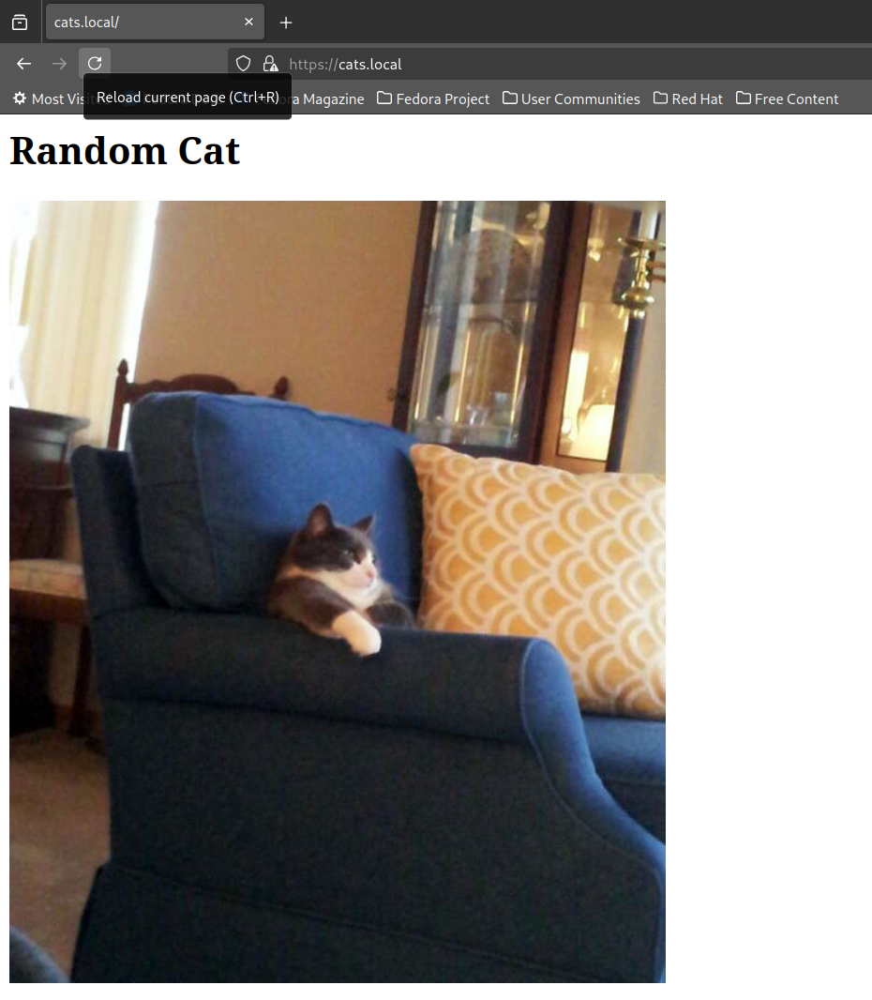
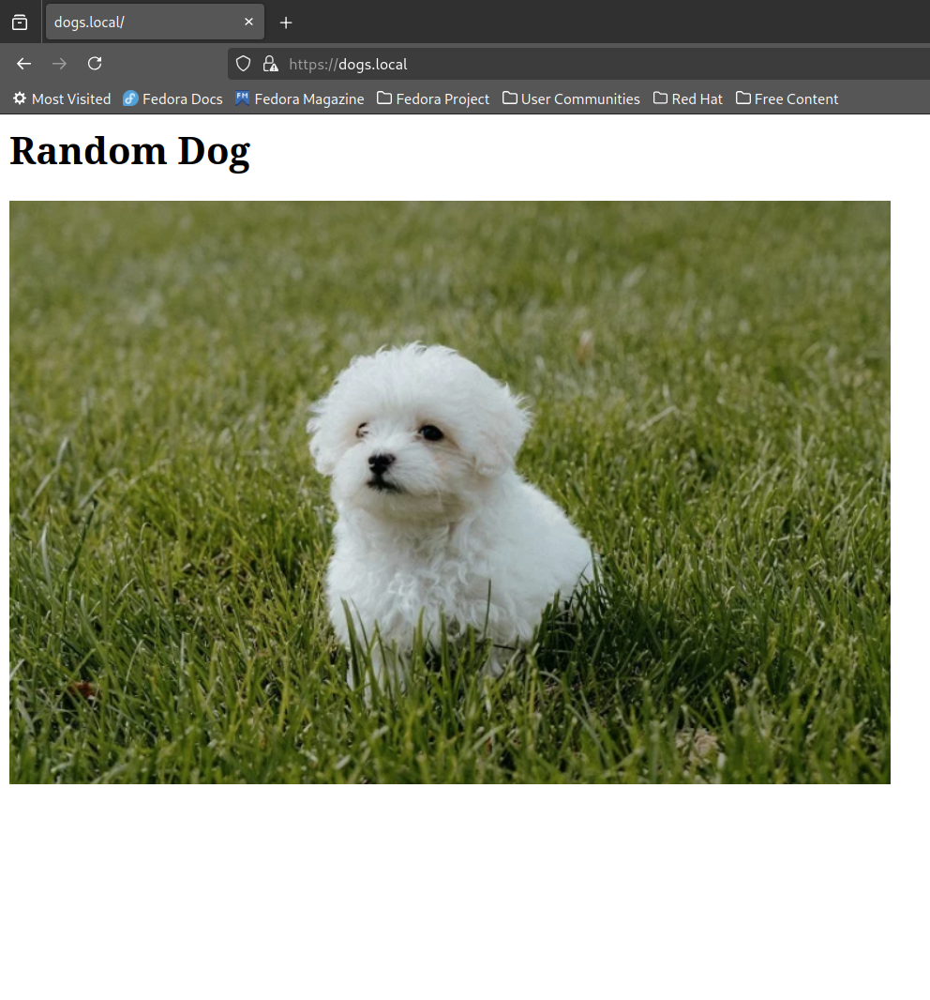

# Лабораторная 1 - Настройка nginx

## Добавление сервисов

Когда-то давно видел как для примера используют апишку с рандомными фотками котов.

Поэтому пришла мысль быстро на FastApi накидать сервисы, которые ходят по таким ручкам и показывают картинки. Первый сервис по котам и второй по собакам.

## Простая контейнеризация сервисов

Для удобства быстро всё убернем в докер

```dockerfile
FROM python:3.11-slim AS dependencies

RUN --mount=type=cache,target=/var/lib/apt/lists apt-get update && apt-get install -y \
    && rm -rf /var/lib/apt/lists/*

WORKDIR /app

COPY requirements.txt .

RUN --mount=type=cache,target=/root/.cache/pip pip install --upgrade pip && \
    pip install -r requirements.txt

FROM python:3.11-slim AS runtime

WORKDIR /app

COPY --from=dependencies /usr/local/lib/python3.11/site-packages /usr/local/lib/python3.11/site-packages
COPY --from=dependencies /usr/local/bin /usr/local/bin

COPY main.py .

EXPOSE 8080

CMD ["python", "main.py"]
```

и компоуз

```yaml
services:
  project-1:
    build: ./project-1

  project-2:
    build: ./project-2
```

## Простая настройка nginx для http

Для начала напишем простой nginx конфиг для того, чтобы можно ходить по http и проверим его работоспособность

Добавим nginx в компоуз

```yaml
services:
  project-1:
    build: ./project-1
    networks:
      - nginx-network

  project-2:
    build: ./project-2
    networks:
      - nginx-network

  nginx:
    image: nginx:alpine
    ports:
      - "80:80"
    volumes:
      - ./nginx.conf:/etc/nginx/nginx.conf
    depends_on:
      - project-1
      - project-2
    networks:
      - nginx-network


networks:
  nginx-network:
    driver: bridge
```

и напишем сам конфиг

```nginx
events {}

http {
    upstream project1 {
        server project-1:8080;
    }

    upstream project2 {
        server project-2:8080;
    }

    server {
        listen 80;

        location /cats/ {
            proxy_pass http://project1/random-cat;
        }

        location /dogs/ {
            proxy_pass http://project2/random-dog;
        }

        location / {
            return 404 "Not Found";
        }
    }
}
```

## Генерация сертификата

Для начала сгенерируем самподписанный ssl сертификат 

```bash
openssl req -x509 -newkey rsa:4096 -keyout key.pem -out cert.pem -sha256 -days 3650 -nodes -subj '/CN=localhost'
```

(для демонстративных целей думаю нормально закинуть их в гит)

## Подключение сертификата

Создадим и прокинем всю папку nginx в docker, чтобы сразу отсылать и сертификат с ключем, и конфиг

```yaml
    volumes:
      - ./nginx/:/etc/nginx/
```

И подключим этот сертификат в nginx - создав также общий server для https. Теперь можем его проверить

```nginx
server {
    listen 443 ssl;

    ssl_certificate /etc/nginx/cert.pem;
    ssl_certificate_key /etc/nginx/key.pem;

    location /cats/ {
        proxy_pass http://project1/random-cat;
    }

    location /dogs/ {
        proxy_pass http://project2/random-dog;
    }

    location / {
        return 404 "Not Found";
    }
}
```

## Проброс http -> https

Еще нужно пробросить http -> https

```nginx
server {
    listen 80;

    location / {
        return 301 https://$host$request_uri;
    }
}
```

## Добавление alias для доступа к /static/ роуту

Добавим файлы и прокинем их в докер

```yaml
    volumes:
      - ./nginx/:/etc/nginx/
+     - ./images:/var/www/static
```

Добавим статичные файлы через alias

```nginx
location /static/ {
    alias /var/www/static/;
}
```

## Использование "виртуальных хостов"

Хотим чтобы котов мы получали по cats.local, а собак по dogs.local

Для начала обновим `/etc/hosts`

```
127.0.0.1 cats.local dogs.local
```

И разделим https проксирование на два server'а, а также добавим server_name

```nginx
	server {
        listen 443 ssl;

        ssl_certificate /etc/nginx/cert.pem;
        ssl_certificate_key /etc/nginx/key.pem;

        server_name cats.local;

        location = / {
            proxy_pass http://project1/random-cat;
        }

        location /static/ {
            alias /var/www/static/cats/;
        }
        
        location / {
            return 404;
        }
    }

    server {
        listen 443 ssl;

        ssl_certificate /etc/nginx/cert.pem;
        ssl_certificate_key /etc/nginx/key.pem;

        server_name dogs.local;

        location = / {
            proxy_pass http://project2/random-dog;
        }

        location /static/ {
            alias /var/www/static/dogs/;
        }

        location / {
            return 404;
        }
    }
```

## Скрины результата




