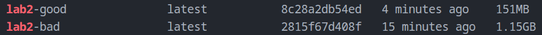
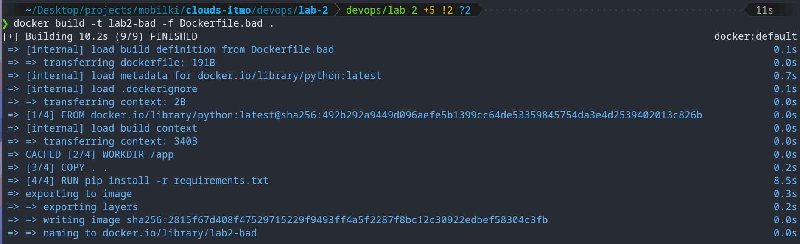
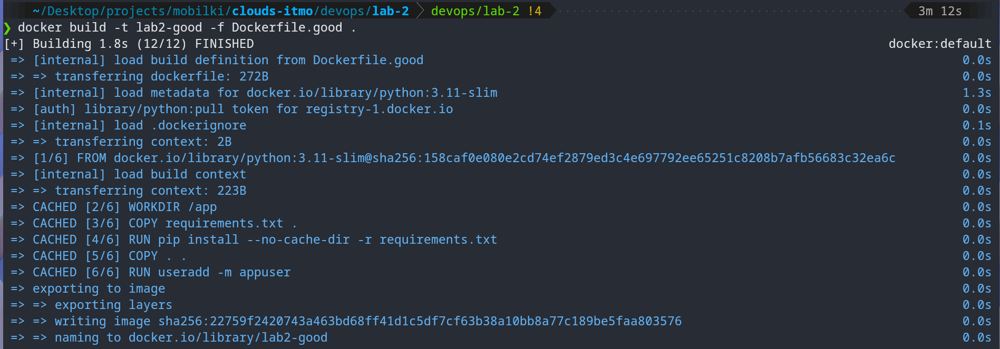
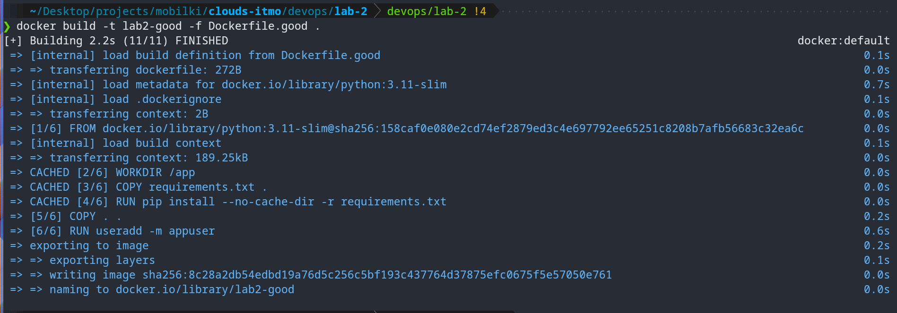

# Лабораторная 2 - Практики Docker

## Плохой Dockerfile

```dockerfile
FROM python:latest

WORKDIR /app

COPY . .

RUN pip install -r requirements.txt

CMD ["uvicorn", "main:app", "--host", "0.0.0.0", "--port", "8000"]
```

## Bad pratices

### 1. Использование тега latest

Образ весит очень много, так как основан на полноценном Debian. Также тег latest меняется со временем, что может привести к непредсказуемому поведению при обновлении версии Python.

Исправление: Использование конкретной версии `python:3.11-slim`.

#### Разница в размере образов



### 2. Копирование излишних файлов (Плохое кэширование)

Проблема конкретно здесь - копирование всего исходного кода `COPY . .` перед установкой зависимостей.

Любое изменение в коде приложения инвалидирует кэш для слоя с установкой зависимостей. Docker будет заново скачивать и устанавливать все пакеты при каждой сборке, даже если requirements.txt не менялся.

Исправление: Сначала копируем `requirements.txt`, устанавливаем зависимости, и только потом копируем код.

Плюс пропишем `--no-cache-dir` для `pip` чтобы уменьшить размер образа, так как мы кэшируем весь стейдж. (но это уже лайфхак конкретно относящийся к питону)

#### Запуск сборки Dockerfile.bad без изменений в коде


#### Запуск сборки Dockerfile.bad с изменениями в коде



Обратим внимание, что при изменениях в файлах, зависимости действительно начали собираться заново. 8,5 секунд, против 0.

#### Запуск сборки Dockerfile.good без изменений в коде



#### Запуск сборки Dockerfile.good с изменениями в коде



Никаких изменений в стейдже установки зависимостей.

### 3. Запуск от имени root

Если злоумышленник получит доступ к приложению, он получит права root внутри контейнера, что упрощает атаку на хост-систему.

Исправление: Создание отдельного пользователя и переключение на него через USER.

## Хороший Dockerfile

```dockerfile
FROM python:3.11-slim

WORKDIR /app

COPY requirements.txt .

RUN pip install --no-cache-dir -r requirements.txt

COPY . .

RUN useradd -m appuser
USER appuser

CMD ["uvicorn", "main:app", "--host", "0.0.0.0", "--port", "8000"]
```

## Плохие практики работы с контейнерами

### 1. Хранение данных внутри контейнера

Контейнеры эфемерны. При удалении или пересоздании контейнера все данные будут безвозвратно потеряны.

Поэтому стоит всегда использовать volumes.

### 2. Отсутствие лимитов ресурсов

Один контейнер с утечкой памяти или высокой нагрузкой может начать использовать все ресурсы хост-машины. Может вызвать зависание или банально не дать нужных ресурсов для других контейнеров / процессов.

Поэтому стоит всегда задавать лимиты ресурсов при запуске или в docker-compose.
